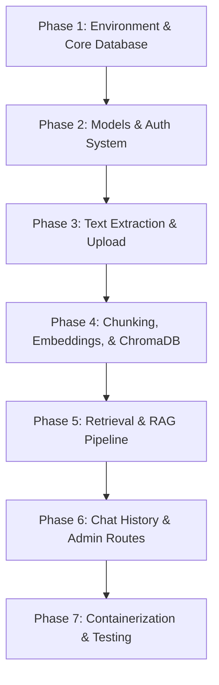

# SmartDocs AI - Project Progress Tracking

This document tracks the planning, implementation milestones, and updates for the SmartDocs AI Backend project. It has been updated to incorporate the detailed architectural and security insights from the updated development guide.

---

## Project Overview
SmartDocs AI is a secure, multi-tenant RAG (Retrieval-Augmented Generation) document assistant. It allows users to upload documents (PDF, DOCX, TXT), extracts and indexes their contents into vector storage (ChromaDB) and metadata storage (MongoDB), and enables natural language Q&A with strict user-level isolation.

---

## Technical Stack
- **Framework**: FastAPI (Asynchronous Python 3.11+)
- **Database**: MongoDB (via Motor async driver)
- **Vector Database**: ChromaDB (with local persistence)
- **Embeddings**: Sentence-Transformers (`all-MiniLM-L6-v2`) locally or OpenAI (`text-embedding-3-small`)
- **LLM Engine**: OpenAI (`gpt-4o-mini`)
- **Security**: OAuth2 with JWT, password hashing with bcrypt, separate keys for access/refresh, refresh token rotation
- **Deployment**: Docker & Docker Compose

---

## Implementation Roadmap

### Phase 1: Environment & Core Database
- [x] Create virtual environment and install dependencies (`requirements.txt`)
- [x] Set up `.env` configurations and validation schema (`app/core/config.py`)
- [x] Implement asynchronous MongoDB client (`app/core/database.py`)
- [x] Create entry point `app/main.py` with database lifespan events and unique indexing
- [x] Configure centralized logging utility (`app/core/logging.py`) with silenced library noise
- [x] Implement global HTTP exception handler for catching unhandled errors (`app/main.py`)

### Phase 2: MongoDB Models & Authentication
- [x] Implement PyObjectId and MongoDB-compatible schemas (`app/models/user.py`)
- [x] Implement password hashing and verification using direct `bcrypt` (`app/core/security.py`)
- [x] Implement short-lived Access Token (15 min) and long-lived Refresh Token (7 days) generation with separate keys (`app/core/security.py`)
- [x] Set up FastAPI security OAuth2 scheme and user/admin dependency injection with activity/admin validation (`app/dependencies.py`)
- [x] Build registration (`/auth/register`), login (`/auth/login`), profile view (`/auth/me`), and profile update (`PUT /auth/me`) endpoints (`app/routers/auth.py`)
- [x] Implement silent refresh token rotation endpoint (`POST /auth/refresh`) to rotate access & refresh tokens safely (`app/routers/auth.py`)

### Phase 3: Text Extraction & Document Uploads
- [x] Implement Document models and response schemas with status tracking (`pending`, `indexed`, `failed_unreadable`, `failed_error`, `deleting`) (`app/models/document.py`)
- [x] Build custom `ScannedPDFError` exception for scanned/image-only PDFs (`app/services/extraction.py`)
- [x] Build multi-format text extraction service (PyMuPDF for PDF, python-docx for DOCX, fallback for TXT) without pre-flight checks to avoid double I/O (`app/services/extraction.py`)
- [x] Build upload size validation (10MB limit), extension checks, and file streaming writer (1MB chunks) to prevent memory exhaustion (`app/routers/documents.py`)
- [x] Build polling endpoint `/documents/{document_id}/status` returning indexing status and error messages (`app/routers/documents.py`)
- [x] Implement paginated document listing returning an envelope with `total`, `page`, `page_size`, and `total_pages` (`app/routers/documents.py`)
- [x] Implement ordered document deletion strategy (mark `deleting` -> delete ChromaDB vectors -> delete disk file -> delete Mongo record) (`app/routers/documents.py`)

### Phase 4: Chunking, Embeddings, & ChromaDB Storage
- [x] Implement `RecursiveCharacterTextSplitter` with sentence-aware separators (500 size, 50 overlap) (`app/services/chunking.py`)
- [x] Build configurable embedding provider (local `sentence-transformers/all-MiniLM-L6-v2` or OpenAI `text-embedding-3-small`) with cached model singleton (`app/services/embeddings.py`)
- [x] Set up ChromaDB PersistentClient and collection definitions with cosine distance metrics (`app/services/vectorstore.py`)
- [x] Implement asynchronous background worker for text extraction and chunking, offloading CPU-bound sync tasks to `asyncio.to_thread` (`app/routers/documents.py`)
- [x] Implement batch indexing method in ChromaDB with metadata scopes (`user_id`, `document_id`, `filename`, `chunk_index`, `chunk_text`) for multi-tenant isolation (`app/services/vectorstore.py`)
- [x] Update MongoDB status on indexing success (`indexed` + `chunk_count`) and handle unreadable PDF vs. generic indexing errors (`app/routers/documents.py`)

### Phase 5: Semantic Retrieval & RAG Pipeline
- [x] Build semantic retrieval with cosine similarity scoring, relevance thresholding (> 0.3), and strict `user_id` security isolation (`app/services/retrieval.py`)
- [x] Implement RAG prompt template with strict instructions for citations and out-of-domain handling ("I don't have enough information...") (`app/services/rag.py`)
- [x] Implement OpenAI chat completion integration with low temperature (0.1) using `gpt-4o-mini` (`app/services/rag.py`)
- [x] Create `/chat/ask` route to validate document ownership, execute the RAG pipeline, and return citations (`app/routers/chat.py`)

### Phase 6: Chat History & Admin Panel
- [x] Create ChatMessage and ChatHistoryInDB Pydantic schemas (`app/models/chat.py`)
- [x] Implement auto-persistence of Q&A history using upsert operations on `/chat/ask` (`app/routers/chat.py`)
- [x] Build history retrieval (`GET /chat/history`) and history purge (`DELETE /chat/history`) routes with optional document filtering (`app/routers/chat.py`)
- [x] Build admin-only stats endpoint `/admin/stats` returning aggregated user, doc, indexed, and chat session counts (`app/routers/admin.py`)
- [x] Build paginated admin endpoints for user listing and global document tracking with user details (`app/routers/admin.py`)

### Phase 7: Containerization & Integration Testing
- [x] Author Dockerfile with system dependencies (`libmupdf-dev`) and optimized layer caching
- [x] Author docker-compose configurations with multi-service linkages and local volumes
- [x] Execute manual verification script covering all endpoints (auth, upload, polling, chat, admin, and security isolation)

---

## Key Security & Reliability Guidelines
1. **Multi-Tenant Isolation**: Embeddings stored in ChromaDB must include `user_id` metadata. All retrieval operations must strictly apply the `user_id` equality filter.
2. **Access Token Short Expiry**: Access tokens expire in 15 minutes. Session continuity must be handled on the frontend via `/auth/refresh` using refresh tokens.
3. **No Memory Bloat**: Stream document uploads in chunks (e.g., 1MB) directly to disk. Never read the entire uploaded file into memory at once.
4. **Non-Blocking Execution**: Use `asyncio.to_thread` to offload CPU-intensive sync libraries (like PyMuPDF text extraction, SentenceTransformers encoding) from FastAPI's async event loop.
5. **Ordered Deletion**: Deletion must follow: Mark `deleting` in Mongo -> Delete from ChromaDB -> Delete from disk -> Delete from MongoDB. This protects against ghost embeddings or orphaned records.

---

## Current Status
- **Current Milestone**: Phase 7 (Containerization & Integration Testing) Completed
- **Latest Major Changes**: 
  - Authored a `Dockerfile` using `python:3.11-slim`, establishing necessary system dependencies (`libmupdf-dev`) and optimized package layer caching.
  - Developed a `docker-compose.yml` file to orchestrate the FastAPI backend, local MongoDB services, and persistent volumes.
  - Created a robust Python-based integration verification script (`verify_endpoints.py`) testing the end-to-end lifecycle: Auth, Uploads, Polling, RAG QA, and strict multi-tenant security verification.
  - The backend server is now fully containerized, tested, and ready for deployment.
- **Active Task**: All phases completed. Ready to transition to Frontend Development (Streamlit).
